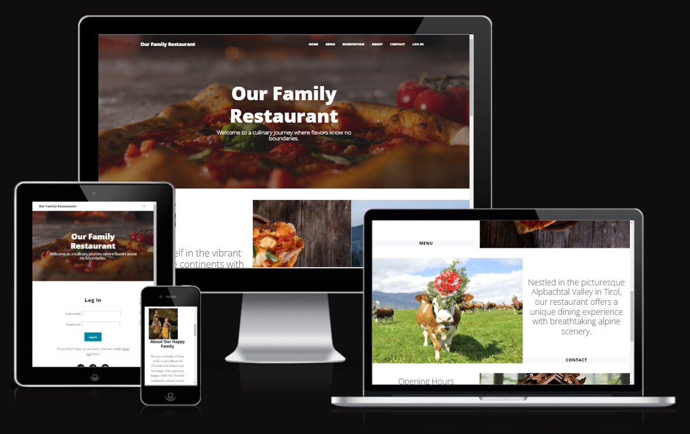
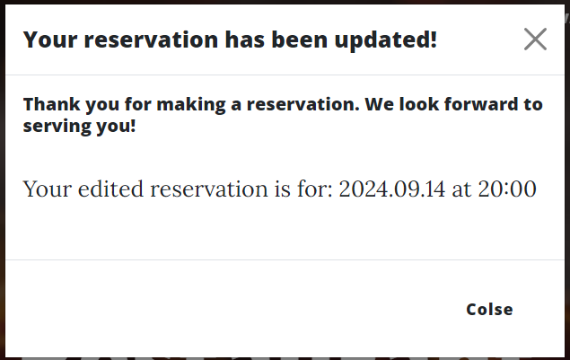

# Our Family Restaurant

### Overview
The Our Family Restaurant website is designed to provide a comprehensive and user-friendly experience for both our customers and staff. Built with a focus on ease of use and functionality, this platform offers a range of features aimed at enhancing your dining experience and streamlining restaurant operations.

### Key Features

1. Online Reservations:

  * Guest Reservations: Allow customers to make reservations directly from the website. Users can select their preferred date, time, and table without needing to call the restaurant. The system ensures table availability and prevents double-booking.
  * Admin Reservations Management: Admins can view, edit, and manage reservations through a secure admin interface. This feature helps in tracking and organizing reservations efficiently.

2. Dynamic Menu Management:

  * Menu Display: Showcases an up-to-date menu with detailed descriptions and pricing. Customers can view the menu online before their visit.
  * Admin Menu Management: Admins can easily add, update, or remove menu items using an intuitive backend interface, ensuring that the menu remains current.

3. Opening Hours and Table Management:

  * Opening Hours: Clearly display the restaurant’s operating hours for each day of the week.
  * Table Availability: Track and manage table status to ensure optimal seating arrangements and avoid conflicts.

4. Customer Interaction:

  * Feedback and Comments: Guests can leave comments or special requests with their reservations. This feedback helps in personalizing their dining experience.
  * Contact Information: Provides clear and accessible contact details.

5. Admin Dashboard:

  * Reservation Overview: Admins have a comprehensive view of all reservations, with options to filter by date, time, and table.
  * Table Status Management: Easily update table statuses to reflect current availability, making table management straightforward.

6. Responsive Design:

  * The website is designed to be fully responsive, ensuring that it works seamlessly across different devices and screen sizes.

### Purpose
The Our Family Restaurant website was created to modernize and enhance the dining experience by integrating convenient online features and efficient management tools. It simplifies the reservation process for customers, making it more accessible and less time-consuming. For restaurant staff, it provides an organized system for managing reservations, updating menus, and maintaining table availability, thereby improving overall operational efficiency.

We hope that this website serves as a valuable resource for both our guests and our team, making every visit to Our Family Restaurant enjoyable and hassle-free.

You can see the deployed website [here]().

You can see the GitHub Repository [here](https://github.com/DesislavaNaydenova/PP4_OurFamilyRestaurant).

---

## CONTENTS

* [User Experience](#user-experience-ux)
  * [User Stories](#user-stories)

* [Design](#design)
  * [Colour Scheme](#colour-scheme)
  * [Typography](#typography)
  * [Imagery](#imagery)
  * [Wireframes](#wireframes)

* [Features](#features)
  * [General Features on Each Page](#general-features-on-each-page)
  * [Future Implementations](#future-implementations)

* [Database Schema](#database-schema)
  * [Entity-Relationship Diagram](#entity-relationship-diagram)

* [Technologies Used](#technologies-used)
  * [Frontend Technologies](#frontend-technologies)
  * [Backend Technologies](#backend-technologies)
  * [Deployment and Hosting](#deployment-and-hosting)
  * [Developmemnt Tools](#developmemnt-tools)
  * [Additional Frameworks, Libraries & Programs Used](#additional-frameworks-libraries--programs-used)

* [Deployment & Local Development](#deployment--local-development)
  * [Deployment](#deployment)
  * [Local Development](#local-development)
    * [How to Fork](#how-to-fork)
    * [How to Clone](#how-to-clone)

* [Testing](#testing)
  * [AUTOMATED TESTING](#automated-testing)
    * [W3C Validator](#w3c-validator)
    * [PEP8 Validator](#pep8-validator)
    * [JavaScript Validator](#javascript-validator)
    * [Lighthouse](#lighthouse)
    * [WAVE Testing](#wave-testing)
  * [MANUAL TESTING](#manual-testing)
    * [Testing User Stories](#testing-user-stories)
    * [Full Testing](#full-testing)

* [Bugs](#bugs)
  * [Fixed Bugs](#fixed-bugs)
  * [Unfixed Bugs](#unfixed-bugs)

* [Credits](#credits)
  * [Code Used](#code-used)
  * [Content](#content)
  * [Media](#media)
  * [Acknowledgments](#acknowledgments)

---

## User Experience (UX)

The user experience on the finished restaurant website should be intuitive, engaging, and efficient. Here’s a breakdown of what the experience should look like for both visitors (guests) and registered users, as well as the admin:

* General User Experience
  * Intuitive Navigation: The website should be easy to navigate, with a clear and simple menu bar or navigation system that allows users to quickly find what they need (e.g., menu, reservations, location).
  * Responsive Design: The site should be fully responsive, ensuring a seamless experience on desktops, tablets, and mobile devices.
  * Visual Appeal: The design should be visually appealing, reflecting the restaurant's brand and atmosphere. High-quality images of the restaurant and its dishes should be prominently featured.
  * Performance: The website should load quickly, with minimal latency, to keep users engaged.
  * Accessibility: The website should be accessible to all users, including those with disabilities, by following best practices like alt text for images, keyboard navigation, and screen reader compatibility.

### User Stories

See our [GitHub User Stories](https://github.com/users/DesislavaNaydenova/projects/4/views/1)

## Design

The design of this project is crafted to ensure a modern, user-friendly, and visually appealing experience, it maintains consistency across all pages and components to provide a unified and professional look. Reusable design elements and patterns are applied to ensure that the interface is predictable and familiar to users.

### Colour Scheme

The color scheme for this project is inspired by the base palette provided by [Start Bootstrap](https://startbootstrap.com/)

### Typography

For this project, I used the typography base from [Start Bootstrap](https://startbootstrap.com/). Start Bootstrap provides a clean and modern design foundation, which includes a well-thought-out typographic system.
The project utilizes the font stack provided by Start Bootstrap, which includes popular web-safe fonts and Google Fonts. This ensures consistent and readable text across different devices and browsers.

### Imagery

The images used throughout this project are carefully selected to showcase both the culinary delights and the stunning natural surroundings that define our restaurant experience. Our aim is to not only tempt your taste buds with visually appealing dishes but also to immerse you in the beautiful environment in which we live and operate.

### Wireframes

Wireframes were created for mobile, tablet and desktop using balsamiq.

## Features

The website is comprised of a home page, a menu page, a reservation page, a log in page, a user reservation page, a guest reservation page, 404 error page and if the user is loged in as admin, he can easily go to the admin panel.

All Pages on the website are responsive and have:

- A favicon in the browser tab.

- A responsive navbar.

- A header.

- A footer.

### General features on each page

- Interactive homepage with sliding images, links to the menu, reservation and contact page also showing the opening hours.

- Menu page.

- Log In, Register, Guest page.

- Reservation page.

- About page.

- Contact page.

- If the user is loged in:

- If the admin is loged in:

- List of upcoming reservations with options for edit and cancel.

- Reservation confirmation modal.

- Reservation edit confirmation modal.

- Cancelation warning.

- Reservation cancel confirmation modal.

### Future Implementations

1. Native Forms and Pages for Admin Actions: In future updates, we plan to integrate native forms and dedicated pages for managing administrative tasks directly within the website. This will include:
- Admin Dashboard: A centralized dashboard where administrators can easily manage reservations, view booking statistics, and handle user inquiries.
- Reservation Management: Forms and pages for reviewing, editing, and canceling reservations.
- User Management: Interfaces for managing user accounts, including the ability to view, edit, and deactivate user accounts as necessary.
- Content Management: Tools for updating and managing menu items, gallery images, and other content on the website without needing direct access to the codebase.

2. Family Gallery: The website includes a gallery showcasing family photos. This section highlights the personal and inviting atmosphere of the restaurant, adding a personal touch to the dining experience.

3. Surrounding Area Photos: To enhance the connection with the local area, the website features a gallery of photos depicting the surrounding environment. This includes scenic views and notable landmarks near the restaurant. 

4. Menu Item Images: Each menu item on the restaurant’s website is enhanced with high-quality images. These images are displayed alongside the item descriptions to give customers a visual preview of the dishes. This feature improves the user experience by making the menu more engaging and helping customers make more informed choices.

5. Guest Reservation Model: This model is planned to handle reservations for guests without user accounts.

6. Add a Map to the contact page.

## Database Schema

### Entity-Relationship Diagram
Below is the Entity-Relationship Diagram representing the database structure of the project.

- **Admin:** The Admin table stores information about the administrative users who can manage the site.
- **Users:** The Users table stores data for registered users.
- **Reservations:** The Reservations table stores data for reservations made from registered and not registered(guests) users.
- **Tables:** The Tables table ceeps track of all the tables available in the restaurant , with capacity and current status.
- **OpeningHours:** The OpeningHours table defines the opening an closing times for each day of the week.

## Technologies Used

### Frontend Technologies

- HTML5: The standard markup language used for structuring content on the web.
- CSS3: For styling and layout, providing a responsive and visually appealing design.
- JavaScript: Used for enhancing interactivity and dynamic content on the website.
- Bootstrap: A popular front-end framework for developing responsive and mobile-first websites.

### Backend Technologies

- Django: A high-level Python web framework that enables rapid development of secure and maintainable websites. It handles the server-side logic and integrates with the database.
- Python: The programming language used to build the backend logic of the application.
- PostgreSQL:  An advanced relational database management system used for storing and managing data.

### Deployment and Hosting

- Heroku: A cloud platform used for deploying and managing applications, providing scalable hosting solutions.
- GitHub: A version control system for tracking changes and collaboration on the project's source code.

### Developmemnt Tools

- GitPod: An online IDE that provides a development environment directly from your GitHub repository.

### Additional Frameworks, Libraries & Programs Used

- Django Summernote: An extension for Django that provides a rich text editor for content management.
- Psycopg2: A PostgreSQL adapter for Python, allowing Django to interact with the PostgreSQL database.
- Bleach: A library used for sanitizing HTML input to ensure content safety and security.
- Am I Responsive: A tool used to preview how the website looks on different devices and screen sizes.
- Balsamiq: A wireframing tool used for designing the layout and structure of the website’s interface.
- DBDiagram: A tool used for creating and visualizing database schemas, helping to design and understand the database structure.

## Deployment & Local Development

### Deployment to Heroku (From Code Institute Lessons)

#### Create the Heroku app 
1. Navigate to your Heroku dashboard and create a new app with a unique name.

2. Click on the Settings tab and reveal the config vars. Add a key of DISABLE_COLLECTSTATIC and a value of 1 and click Add.

#### Update your code for deployment
3. Install a production-ready webserver for Heroku.
pip3 install gunicorn~=20.1 
Add gunicorn==20.1.0 to the requirements.txt file with:
pip3 freeze --local > requirements.txt
Note: gunicorn is a production equivalent of the manage.py runserver used in development but with speed and security optimisation.

4. Create a file named Procfile at the root directory of the project (same directory as requirements.txt).
Note: The Procfile has no file extension.

5. In the Procfile, declare this is a web process followed by the command to execute your Django project.
web: gunicorn my_project.wsgi
This assumes your project is named my_project.
Note the space after the colon.
Note: gunicorn my_project.wsgi is the command heroku will use to start the server. It works similarly to python3 manage.py runserver.

6. Open the my_project/settings.py file and replace DEBUG=True with DEBUG=False.
Note the comment regarding security in production.

7. Also, in settings.py we need to append the Heroku hostname to the ALLOWED_HOSTS list
,'.herokuapp.com'
Note: Remember the comma and the dot before herokuapp.

8. You can now git add the files you have modified, git commit them and push them to GitHub.

#### Deploy on Heroku
9. Now, let's return to the Heroku dashboard, and in your app, click on the Deploy tab.

10. In the Deployment method section enable GitHub integration by clicking on Connect to GitHub.
If you have not deployed a project from GitHub before then, you will be asked to authenticate with GitHub.

11. Start typing your project repo name into the search box and click Search. A list of repositories from your GitHub account should appear. Click on the GitHub repo you want to deploy from.

12. Scroll to the bottom of the page and click Deploy Branch to start a manual deployment of the main branch.
You can view the build output in the application's Activity tab in the dashboard.

13. Click on Open app to view your deployed project.
Note: You will have to append /hello to the browser URL just as you did locally to see your view output.

14. Open the Resources tab and choose an eco dyno. This dyno is a lightweight container to run your project.

15. Open the Resources tab and verify there is no existing Postgres database add-on. If there is one you can destroy it. Hello, World does not use a database and if not destroyed can result in usage costs. If there is a database add-on select Delete Add-on to remove it.

16. Click on Open app to view your deployed project.
Note: You will have to append /hello to the browser URL just as you did locally to see your view output.

### Local Development

Follow these steps to set up and run the project on your local machine.

#### Prerequisites
Ensure you have the following software installed on your machine:
- Git: Version control system to clone the repository.
- Node.js and npm: JavaScript runtime and package manager (or any other language/runtime specific to your project).
- Database: If your project requires a database, ensure the appropriate database server is installed and running (e.g., MySQL, PostgreSQL, MongoDB).

#### Step-by-Step Instructions
1. Clone the repository
Open your terminal and run the following command to clone the repository:
bash
git clone https://github.com/your-username/your-project.git
Replace https://github.com/your-username/your-project.git with the actual URL of your repository.

2. Navigate to the project directory
Change into the project directory:
bash
cd your-project

3. Install dependencies
Run the following command to install the necessary dependencies:
bash
npm install
If your project uses another package manager like Yarn, use:
bash
yarn install

4. Set up environment variables
Create a .env file in the root directory of the project and add the necessary environment variables. You can use the provided .env.example as a reference:
bash
cp .env.example .env
Edit the .env file to include your specific configuration values.

5. Set up the database
If your project requires a database, set it up by running the migration and seed scripts. For example, if you're using a Node.js project with Sequelize:
bash
npx sequelize-cli db:migrate
npx sequelize-cli db:seed:all
Adjust the commands according to the ORM or database tool your project uses.
Run the development server

6. Start the development server with the following command:
bash
npm start
Or, if your project uses a different command, replace npm start with the appropriate command.

7. Access the application
Open your web browser and navigate to http://localhost:3000 (or the port specified in your project) to view the running application.

#### How to Fork

1. Navigate to the Repository:
Go to the GitHub repository page for the project you want to fork.

2. Click the Fork Button:
In the top-right corner of the page, click the Fork button. This will create a copy of the repository under your GitHub account.

3. Select Your Account:
If you belong to multiple organizations, you may need to choose where you want to fork the repository (e.g., your personal account or an organization).

4. Access Your Fork:
After forking, you can find the forked repository in your GitHub account’s repositories list. You can now make changes to this copy of the repository.

#### How to Clone

1. Navigate to Your Repository:
Go to the repository page on GitHub (either the original or your forked version).

2. Copy the Repository URL:
Click on the Code button (usually green) and copy the URL provided (either HTTPS or SSH).

3. Open Your Terminal:
Open a terminal or command prompt on your local machine.

4. Run the Clone Command:
Use the git clone command followed by the URL you copied.
- git clone + the actual URL of the repository.

5. Navigate to the Project Directory:
Change to the directory of the cloned project: cd your-repository

6. Install Dependencies (if applicable):
Follow any additional setup instructions provided in the repository’s README.md file to install necessary dependencies and get the project running.

## Testing

### AUTOMATED TESTING

#### W3C Validator

[W3C](https://validator.w3.org/) was used to validate the URL on all pages of the website. It was also used to validate the CSS. 

* [Homepage](https://pp4-our-family-restaurant-8fbc3211d08d.herokuapp.com/) - No errors or warnings. 
* [Menu Page](https://pp4-our-family-restaurant-8fbc3211d08d.herokuapp.com/menu_list) - There is an error coming from the summernote editor, that I coldn't fix and addet to the unfixed bugs.
* [Reservation page](https://pp4-our-family-restaurant-8fbc3211d08d.herokuapp.com/reservations/) - No errors or warnings. 
* [Edit reservation Page](https://pp4-our-family-restaurant-8fbc3211d08d.herokuapp.com/accounts/login/?next=/edit_reservation/45/) - No errors or warnings.
* [Login Page](https://pp4-our-family-restaurant-8fbc3211d08d.herokuapp.com/login/) - No errors or warnings.
* [Make reservation Page](https://pp4-our-family-restaurant-8fbc3211d08d.herokuapp.com/user_reservation/) - Warning: Consider adding a lang attribute to the html start tag to declare the language of this document.
* [User Reservations Page](https://pp4-our-family-restaurant-8fbc3211d08d.herokuapp.com/user_reservations/) - Warning: Consider adding a lang attribute to the html start tag to declare the language of this document.
* [Edit Reservation Page](https://pp4-our-family-restaurant-8fbc3211d08d.herokuapp.com/edit_reservation/51/) - Warning: Consider adding a lang attribute to the html start tag to declare the language of this document.
* [About Page](https://pp4-our-family-restaurant-8fbc3211d08d.herokuapp.com/about/) - No errors or warnings.
* [Contact Page](https://pp4-our-family-restaurant-8fbc3211d08d.herokuapp.com/contact/) - No errors or warnings.
* [Admin Panel](https://pp4-our-family-restaurant-8fbc3211d08d.herokuapp.com/admin/) - This is the built-in Django admin panel used for managing the website’s data and content. While it offers powerful features for administration, you might encounter some errors or warnings. Due to the nature of the built-in panel and its integration with the Django framework, these issues are inherent and cannot be easily fixed within the panel itself.

#### PEP8 Validator

* To ensure code quality and adherence to the PEP8 style guide, I used the [PEP8 validator](https://pep8ci.herokuapp.com/#). Most of the corrections recommended by the validator have been applied to the codebase. However, some issues, particularly those in the settings.py file, were not resolved due to compatibility errors with my editor. Despite this, the core functionality and structure of the project remain intact and well-organized.
  
#### JavaScript Validator

* No errors or warnings. 

#### Lighthouse

#### WAVE Testing

### MANUAL TESTING

#### Testing User Stories

* Each user story was tested, all the issues were addressed and any features planned for future development were noted.

#### Full Testing

* The full manual testing process involved systematically verifying each feature to ensure it performed as expected across different devices and browsers. Every user interaction was tested thoroughly, with detailed documentation of any bugs or issues encountered, all of which were resolved or noted for future development.

## Bugs

### Fixed Bugs

1. When adding a menu item the input is displayed as HTML.

- The solution was to use the bleach library to sanitize the input.

2. In the Opening Hours the days of the week weren't in the right order.

- The solution was to annotate the queryset with the custom order and then order by this annotation.

3. The Date format was not valid

- Changed the format in the user_reservation view in order to fulfill the Django expectations.

4. After deploying it Heroku the siccess modal doesn't show the date and time of the reservation

- Store the reservation date and time in the session so that they can be displayed in the success modal.

5. When trying to edit the reservations time, the user gets an error message, that the table has already been reserved for the day.

- Modify the clean_table method in the UserReservationForm to check if the current reservation instance is the same as the one being edited.

6. It was possible to reserve a specific table for every hour during the open hours, but we don't want that.

- Change the clean_table method in the UserReservationForm, so that a table can not be reserved more than once a day.

7. Getting an attribute error when trying to make a guest reservation.

- Added autocomplete and id to the guest reservation form.

### Unfixed Bugs

1. Due to the Summernote styling an error is being shown when validating the URL of the menu_list

- Removed the h4 elememt, in order to prevent the first error, but the styling from summernote doesn't change.

2. The user gets an error message after trying to submit the reservation, not before.

- Due to lack of time I wasn't able to change the code.

3. The guest reservations are displayed in the User Reservation table of the admin panel, without name.

- I tried to create a gust reservation model and display the guest reservations separatly, but it didn't work correctly so due to lack of time I wasn't able to correct the code and because the reservations are displayed, so the main function is working, I left it as a future implementation.

4. Had problem with the API key for GoogleMaps.

- Decided to leave the Map as a future implementation.

## Credits

- For the structure of the README.md file: [GitHub: Kera Cudmore](https://github.com/kera-cudmore/readme-examples/blob/main/milestone1-readme.md)
- For the basic information and guidance: [CodeInstitute](https://learn.codeinstitute.net/)
- For correcting typos and helping by solving small issues: [ChatGPT](https://chatgpt.com/)
- For Django Documentation: [Django Authentication](https://docs.djangoproject.com/en/5.1/topics/auth/)
- For Django Tutorials: [Django Tutorials](https://developer.mozilla.org/en-US/docs/Learn/Server-side/Django)
- For the FavIcon: [Icons8](https://icons8.com/)
- For Map in the Contact template: [GoogleMaps](https://www.google.com/map)

### Code Used

- For the about page: [Code Instituse Solutions](https://github.com/Code-Institute-Solutions/blog/tree/main/10_create_about_app/about)

- For the map cluster: [CodeInstitute](https://learn.codeinstitute.net/) and [jsfiddle.net/](https://jsfiddle.net/)

- For date and time picker: [flatpickr](https://flatpickr.js.org/)

### Content

- The content for this website, including images and descriptions, is based on the original [Heisthof webpage](https://www.heisthof.net/). We have used this content with the full understanding and permission of the owner. We sincerely appreciate their support and collaboration in bringing this project to life.

###  Media

- The images and media used on this website are inspired by the original [Heisthof webpage](https://www.heisthof.net/). We have obtained permission from the owner to use and adapt this content. We extend our gratitude to the Heisthof team for allowing us to showcase their beautiful visuals and atmosphere through our website.

- For the family photo: [FreePik](https://www.freepik.com/)

- Photos from the Alps: [Unsplash](https://unsplash.com)

  
###  Acknowledgments

I'd like to thank:

- CodeInstitute for their invaluable support and resources, which were crucial in developing this project.

- [The Django Comunity](https://www.djangoproject.com/community/) for their invaluable support and guidance throughout this project. Their expertise and advice have been instrumental in shaping and refining this work.

- My Code Institute Mentor Can Sucullu.

- My Family for their encouragement and patience throughout the journey.

- The Restaurant Owner for their inspiration and support in creating this platform.

- The fantastic Tutor Support team at Code Institute.

Your help and support made this project possible. Thank you!